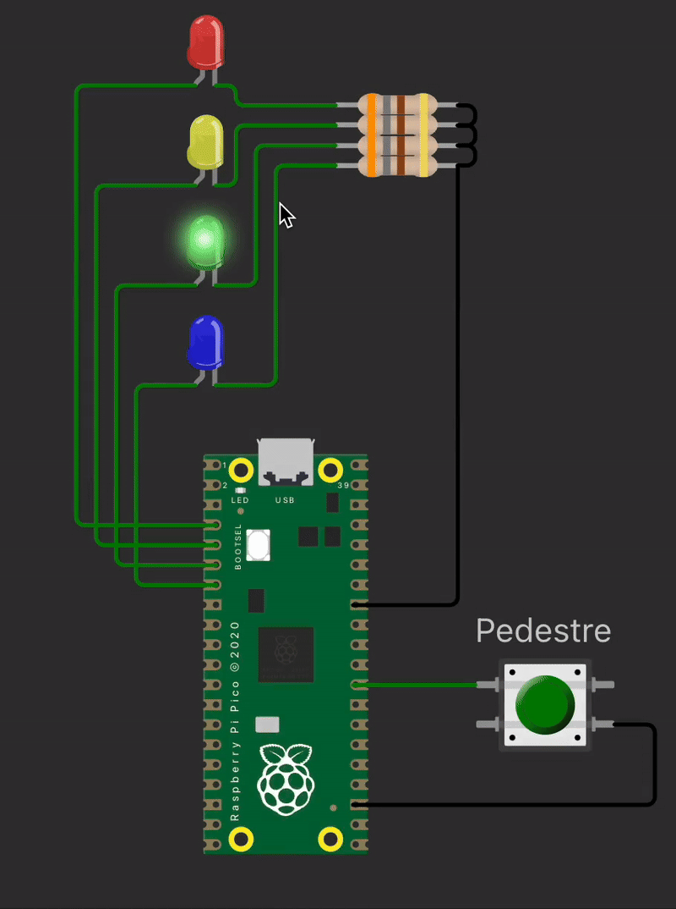

# EXE1

Neste exercício, você deve desenvolver um firmware que:

Seja capaz de exibir valores em um display de 7 segmentos controlado por interrupções de três botões físicos.

### Descrição do circuito:

- Um display de 7 segmentos
- Três botões:
  - Botão de incremento
  - Botão de decremento
  - Botão de reset

Comportamento esperado:

- Ao pressionar o botão de incremento, o display deverá avançar de 0 até 9, depois deve mostrar letra F (Full).
- Ao pressionar o botão de decremento, o display deverá retroceder de 9 até 0, depois deve mostrar a letra E (Error).
- Ao pressionar o botão de reset, o display deve ser zerado (mostrar 0).

## Testes

O código deve passar em todos os testes para ser aceito:

- `embedded_check`
- `firmware_check`
- `wokwi`

Caso acredite que o seu código está funcionando, porém os testes estão falhando, preencha o forms:

[Google forms para revisão manual](https://docs.google.com/forms/d/e/1FAIpQLSdikhET4iqFwkOKmgD-G6Ri-2kCdhDLndlFWXdfdcuDfPnYHw/viewform?usp=dialog)
